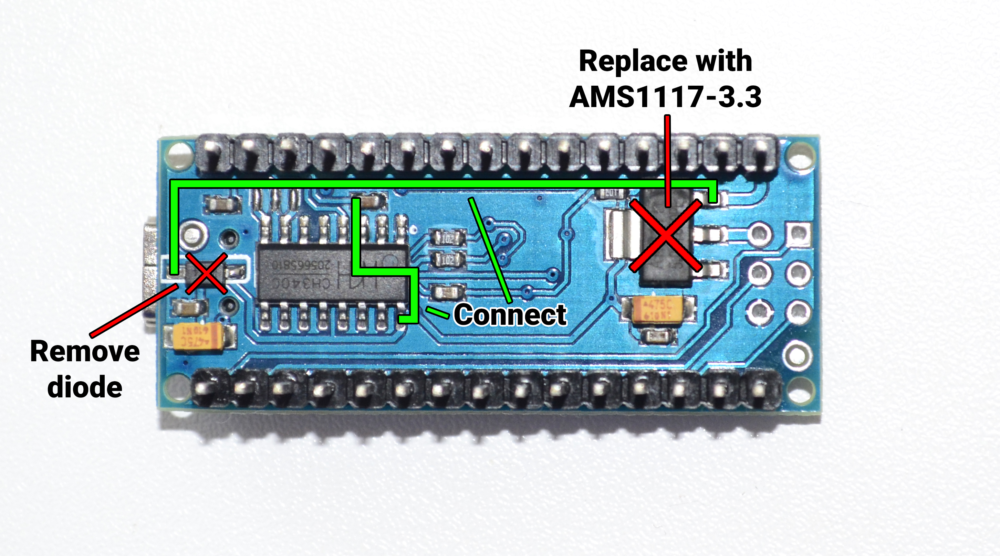

# Arduino Nano 3.3V conversion

+ Remove diode
+ Replace AMS1117-5.0 with AMS1117-3.3
+ Solder jumper wires as shown:

+ Make sure the Arduino is working properly and the maximum pin output voltage is below 3.3V