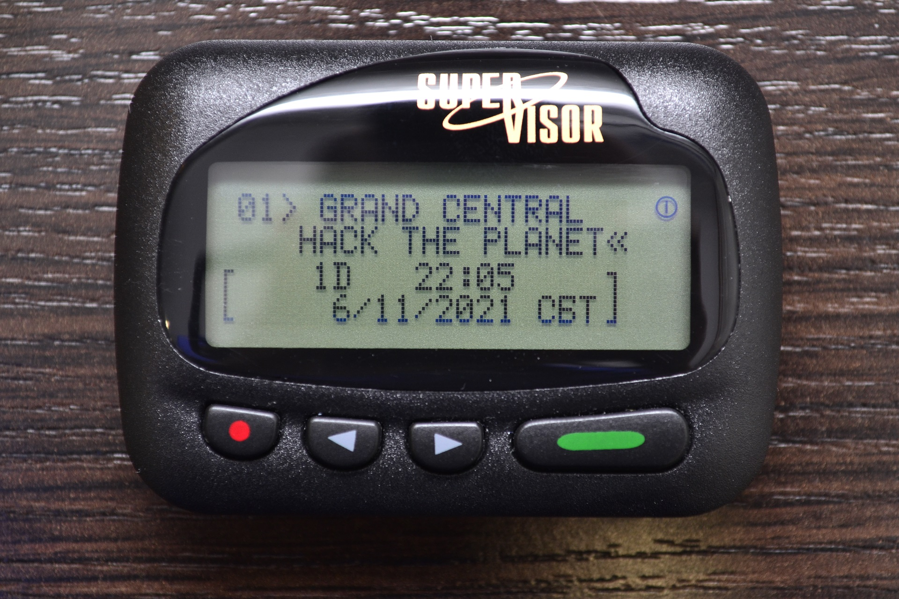

# Arduino POCSAG Transcoder

## Features

+ Message types: `Tone`, `Numeric`, `Alphanumeric`
+ 4 encodings: `Latin`, `2xLatin/Cyrillic`, `Cyrillic`
+ Data rates: `512`, `1200`, `2400bps`
+ Data inversion
+ Frequency range: `80 – 650MHz`, `862 – 940MHz` (see ADF7021 datasheet)

## Required parts

+ Arduino Nano running at `3.3V` ([How to convert](ARDUINO3V3.md))
+ RF7021SE module with `12.288Mhz` or `14.745MHz` TCXO ([How to install](RF7021TCXO.md))

## Wiring

| RF7021 | Arduino |
| ------ | ------- |
| VCC    | VCC     |
| CE     | D6      |
| SLE    | D7      |
| SDATA  | D8      |
| SREAD  | D9      |
| SCLK   | D10     |
| TxRxCLK| D11     |
| TxRxData| D12    |
| GND    | GND     |

## Serial console commands

| Command | Description | Example |
| --- | --- | --- |
| d or D`XXX` | Set frequency deviation in Hz | `d 4500` - set deviation to 4.5KHz |
| f or F`XXX` | Set frequency in Hz | `f 433920000` - set freq to 433.920MHz |
| i or I`X` | Enable/disable data inversion (`0` = OFF, `1` = ON) | `i 0` |
| r or R`XXXX` | Set data rate (`512`, `1200` or `2400`) | `r 512` - set rate to 512kbps |
| x or X | Run transmitter test (transmit 0101... pattern) | `x` |
| c or C`XXXX` | Set CAP code | `c 1234567` |
| s or S`X` | Set message source code (`0` to `3`) | `s 3` |
| e or E`X` | Set encoding (`0` to `3`) | `e 0` - set Latin Motorola encoding |
| n or N`XXXX` | Send numeric message | `n U *123*456*789` |
| m or M`XXXX` | Send alphanumeric message | `m Hello World` |
| t or T | Send tone message | `t` |

## Troubleshooting

| Problem | Possible Solution |
| --- | --- |
| Nothing happens in Serial Console after Arduino connection or device getting stuck | Check Arduino - RF7021SE wiring, try to reset |
| RF7021 doesn't transmit or emits on wrong frequency | Check TCXO connection and `RF_TCXO` value |
| Pager doesn't receive messages | Check RF7021 emission, pager frequency, CAP code, data rate and inversion mode |