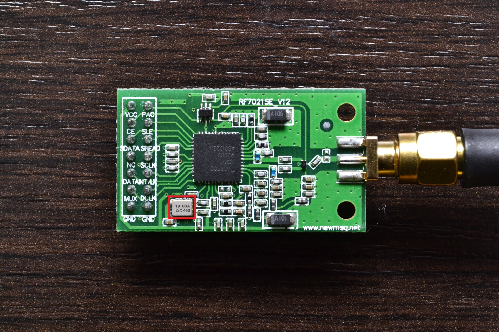
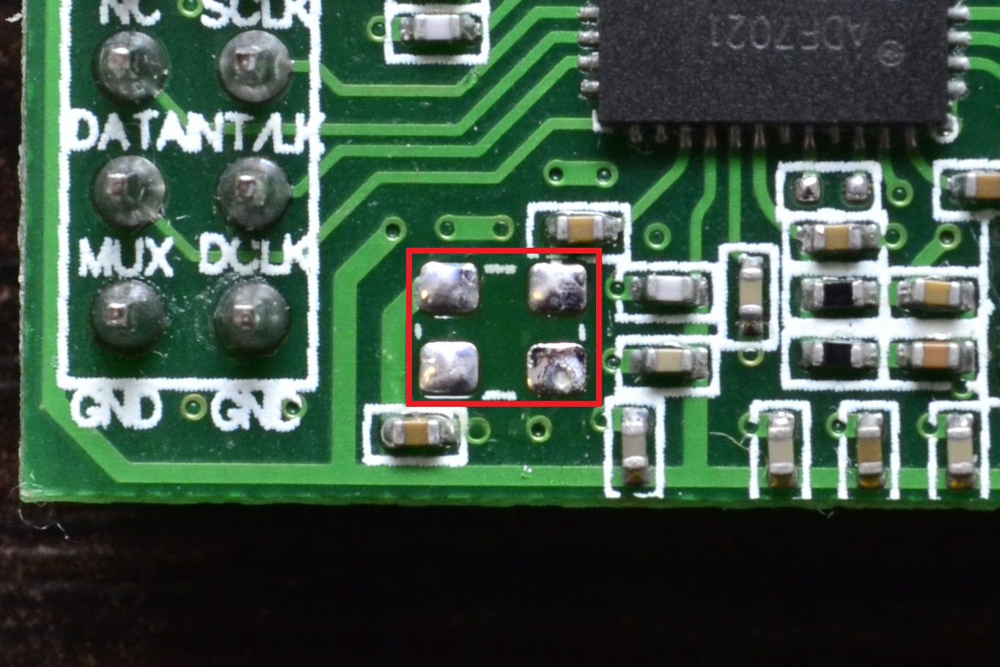
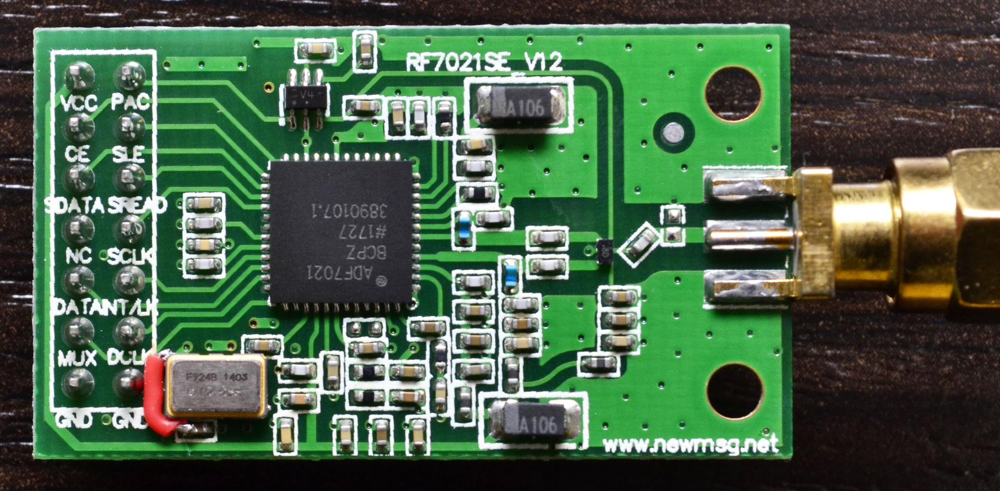
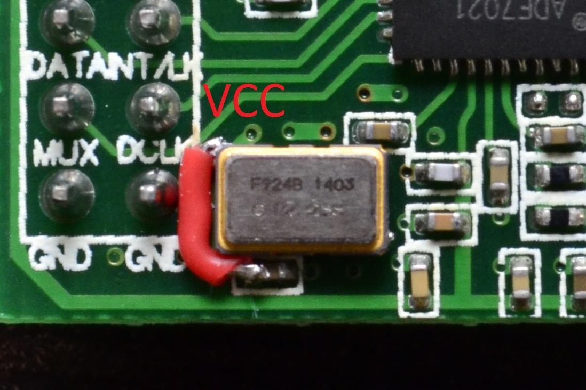

# RF7021SE TCXO replacement

+ Find default `19.68MHz` TCXO on the PCB:

+ And unsolder it:

+ Replace with `12.288Mhz` or `14.745MHz`. Default footprint is 3225, but 5032 can be placed as well:

+ To use 5032 chip you may have to use VCC workaround:

+ Don't forget to change the `RF_TCXO` value to match your TCXO!